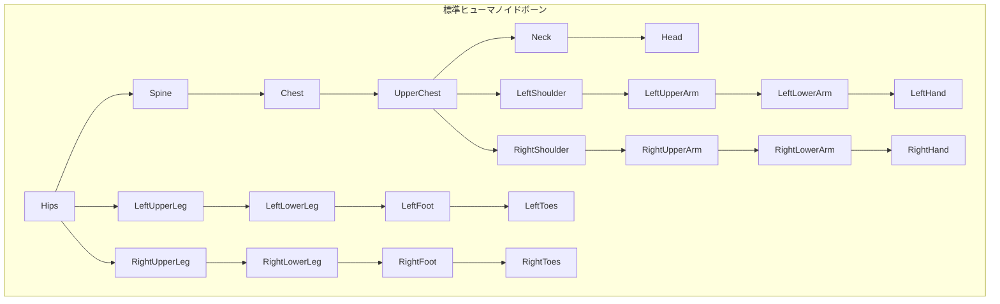
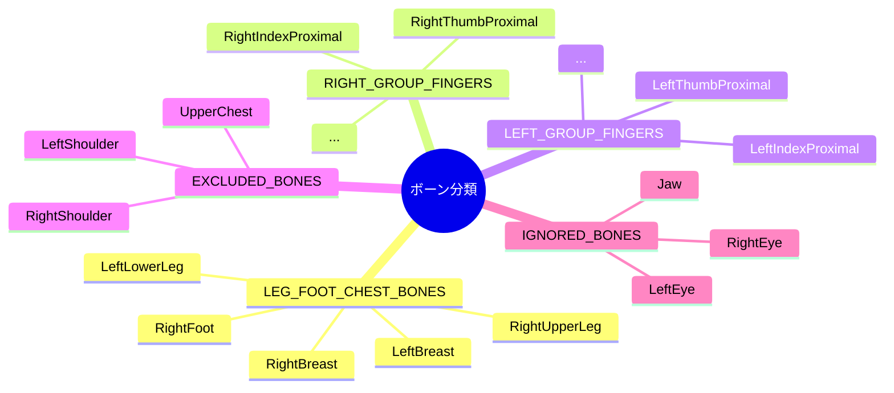

# ボーン階層図

関連: [README](../README.md) | [ウェイト計算](../math/weights.md) | [データフロー](data_flow.md)

ヒューマノイドボーン構造とマッピングを示します。

```mermaid
graph TD
    subgraph "標準ヒューマノイドボーン"
        Hips["Hips"] --> Spine["Spine"]
        Spine --> Chest["Chest"]
        Chest --> UpperChest["UpperChest"]
        UpperChest --> Neck["Neck"]
        Neck --> Head["Head"]

        UpperChest --> LeftShoulder["LeftShoulder"]
        LeftShoulder --> LeftUpperArm["LeftUpperArm"]
        LeftUpperArm --> LeftLowerArm["LeftLowerArm"]
        LeftLowerArm --> LeftHand["LeftHand"]

        UpperChest --> RightShoulder["RightShoulder"]
        RightShoulder --> RightUpperArm["RightUpperArm"]
        RightUpperArm --> RightLowerArm["RightLowerArm"]
        RightLowerArm --> RightHand["RightHand"]

        Hips --> LeftUpperLeg["LeftUpperLeg"]
        LeftUpperLeg --> LeftLowerLeg["LeftLowerLeg"]
        LeftLowerLeg --> LeftFoot["LeftFoot"]
        LeftFoot --> LeftToes["LeftToes"]

        Hips --> RightUpperLeg["RightUpperLeg"]
        RightUpperLeg --> RightLowerLeg["RightLowerLeg"]
        RightLowerLeg --> RightFoot["RightFoot"]
        RightFoot --> RightToes["RightToes"]
    end
```

## ボーングループ分類

```mermaid
mindmap
    root((ボーン分類))
        LEG_FOOT_CHEST_BONES
            RightUpperLeg
            LeftLowerLeg
            RightFoot
            LeftBreast
            RightBreast
        RIGHT_GROUP_FINGERS
            RightThumbProximal
            RightIndexProximal
            ...
        LEFT_GROUP_FINGERS
            LeftThumbProximal
            LeftIndexProximal
            ...
        EXCLUDED_BONES
            UpperChest
            LeftShoulder
            RightShoulder
        IGNORED_BONES
            LeftEye
            RightEye
            Jaw
```

## ウェイト転送フロー

```mermaid
flowchart LR
    A["ベースアバター<br/>ボーンウェイト"] --> B["ボーン名<br/>正規化"]
    B --> C["服メッシュへ<br/>ウェイト転送"]
    C --> D["空ウェイト<br/>頂点検出"]
    D --> E["隣接頂点から<br/>ウェイト伝播"]
```
