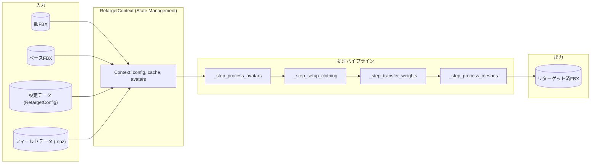
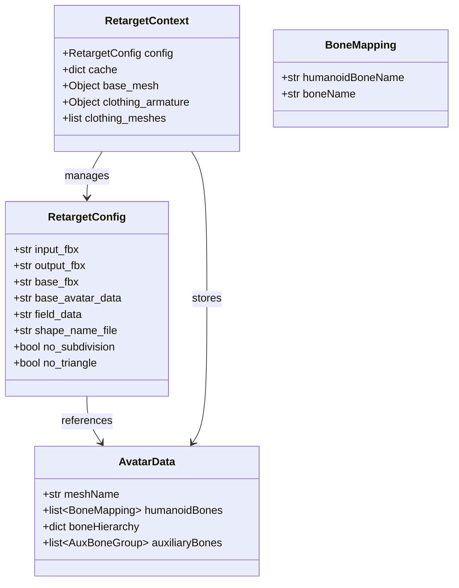
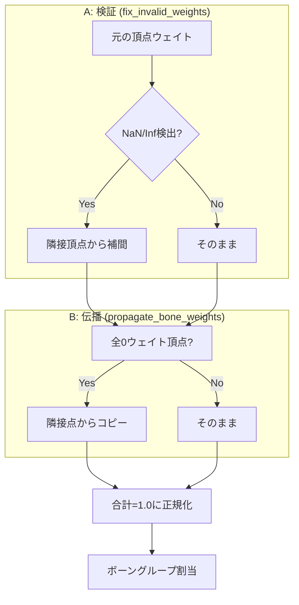

# データフロー図

関連: [README](../README.md) | [シーケンス](sequence.md) | [ボーン](bones.md)

リターゲット処理におけるデータの変換と流れを示します。

## 設定データ構造

## ウェイトデータ変換

---

## ナビゲーション
- [ドキュメント目次](../README.md)
- [システム概要 (Overview)](overview.md)
- [処理シーケンス (Sequence)](sequence.md)
