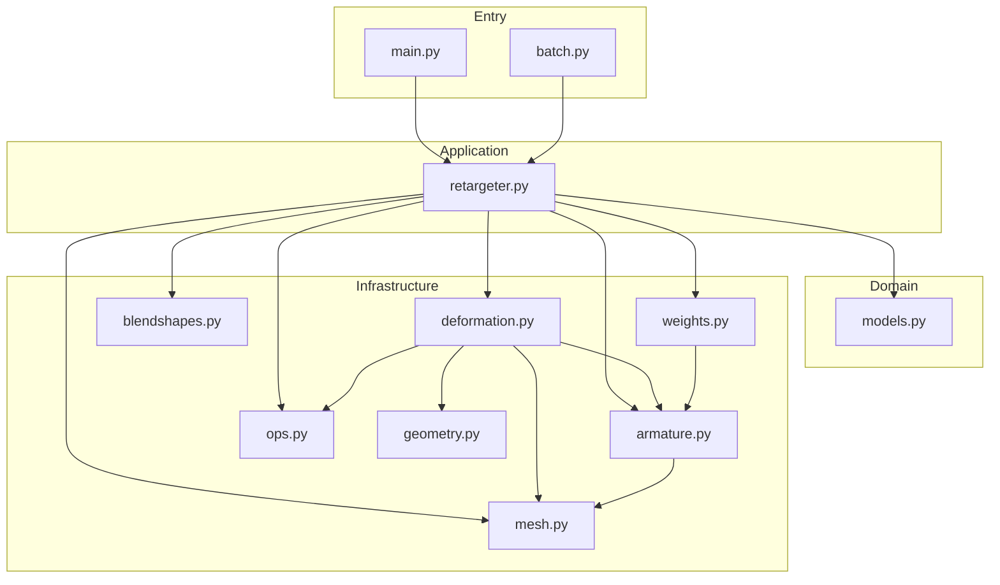

# モジュール依存関係図

関連: [README](../README.md) | [overview](overview.md)

## インポート関係

| モジュール | 依存先 |
|-----------|-------|
| `weights.py` | `armature` |
| `mesh.py` | `numpy`, `bpy`, `bmesh` |
| `armature.py` | `mesh`, `models` |
| `deformation.py` | `armature`, `ops`, `geometry`, `mesh` |
| `geometry.py` | `numpy`, `scipy`, `mathutils` |
| `retargeter.py` | `armature`, `ops`, `blendshapes`, `deformation`, `mesh`, `weights`, `models` |
| `models.py` | (None) |

---

## ナビゲーション
- [ドキュメント目次](../README.md)
- [システム概要 (Overview)](overview.md)
