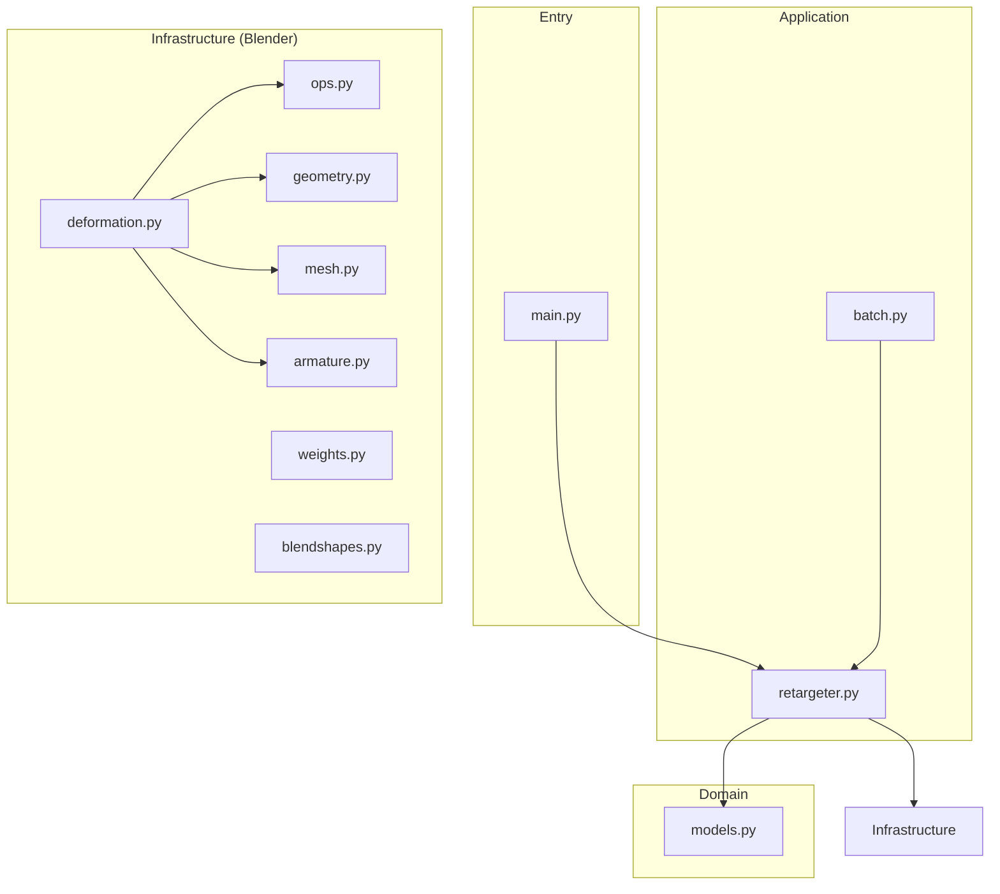
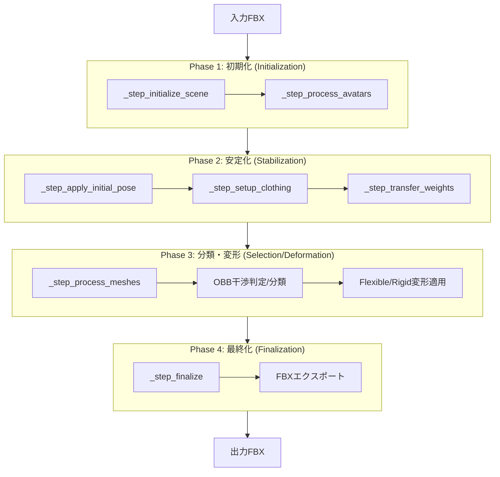

# システム概要

衣装リターゲットシステム。素体の骨格に合わせて衣装モデルを自動調整。

関連: [README](../README.md) | [シーケンス](sequence.md) | [依存関係](dependencies.md)

---

## モジュール構成

---

## 実行フロー

---

## モジュール責務

| レイヤー | モジュール | 責務 | 主要関数 |
|---------|-----------|------|---------|
| Application | `retargeter.py` | パイプライン制御・ユースケース | `execute()`, `_run_pipeline()` |
| Application | `batch.py` | バッチ処理実行 | `main()` |
| Domain | `models.py` | データモデル・設定定義 | `RetargetConfig`, `RetargetContext` |
| Infra | `weights.py` | ウェイト転送・統合・波及 | `update_base_avatar_weights` |
| Infra | `mesh.py` | メッシュ加工・成分分離 | `cleanup_mesh`, `separate_and_combine_components` |
| Infra | `armature.py` | ボーン調整・逆ポーズ計算 | `calculate_inverse_pose_matrix` |
| Infra | `deformation.py` | リターゲット中核ロジック | `retarget_mesh`, `process_field_deformation` |
| Infra | `geometry.py` | RBF変形・相似変換計算 | `batch_process_vertices_multi_step` |
| Infra | `blendshapes.py` | BlendShape同期・正規化 | `sync_shape_key_names_from_file` |
| Infra | `ops.py` | Blender基本操作ラッパー | `apply_y_rotation_to_bone` |
