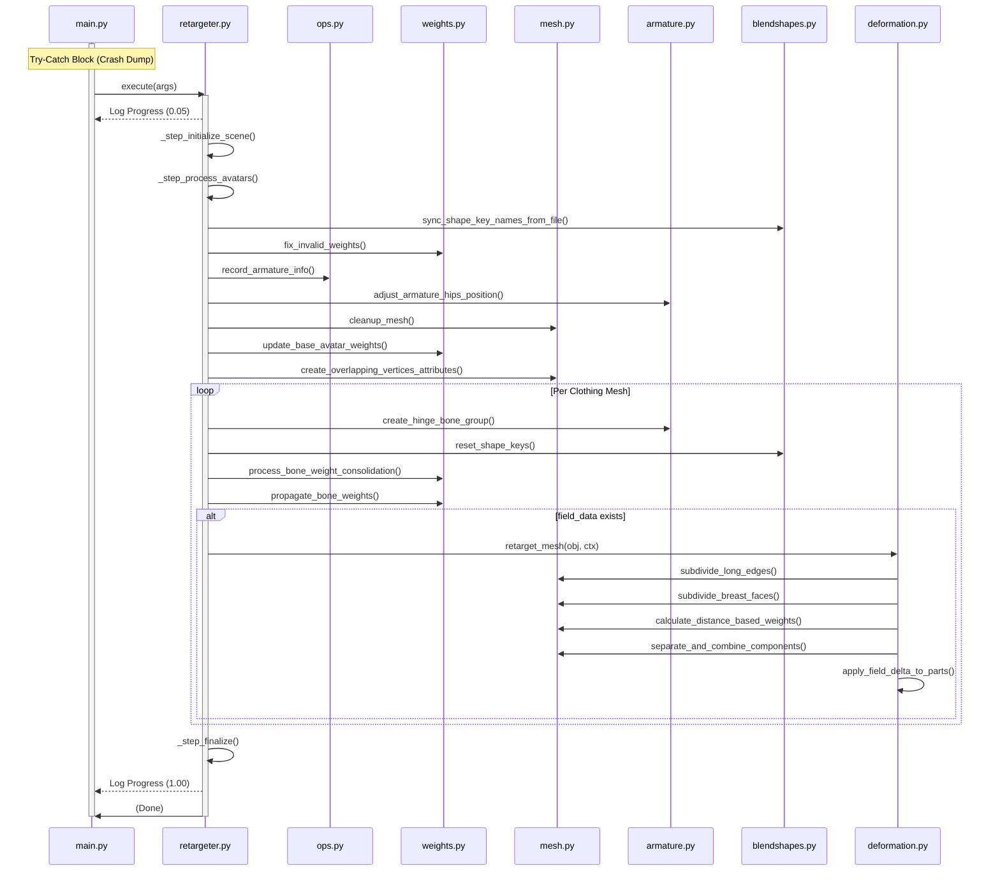
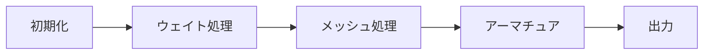

# シーケンス図

関連: [README](../README.md) | [overview](overview.md)

```mermaid
sequenceDiagram
    participant CLI as main.py
    participant RT as retargeter.py
    participant B as ops.py
    participant W as weights.py
    participant M as mesh.py
    participant A as armature.py
    participant BS as blendshapes.py
    participant MD as deformation.py

    activate CLI
    Note over CLI: Try-Catch Block (Crash Dump)
    CLI->>RT: execute(args)
    activate RT
    RT-->>CLI: Log Progress (0.05)
    RT->>RT: _step_initialize_scene()
    RT->>RT: _step_process_avatars()
    
    RT->>BS: sync_shape_key_names_from_file()
    RT->>W: fix_invalid_weights()
    RT->>B: record_armature_info()
    RT->>A: adjust_armature_hips_position()
    RT->>M: cleanup_mesh()
    
    RT->>W: update_base_avatar_weights()
    RT->>M: create_overlapping_vertices_attributes()
    
    loop Per Clothing Mesh
        RT->>A: create_hinge_bone_group()
        RT->>BS: reset_shape_keys()
        RT->>W: process_bone_weight_consolidation()
        RT->>W: propagate_bone_weights()
        
        alt field_data exists
            RT->>MD: retarget_mesh(obj, ctx)
            MD->>M: subdivide_long_edges()
            MD->>M: subdivide_breast_faces()
            MD->>M: calculate_distance_based_weights()
            MD->>M: separate_and_combine_components()
            MD->>MD: apply_field_delta_to_parts()
        end
    end

    RT->>RT: _step_finalize()
    RT-->>CLI: Log Progress (1.00)
    RT->>CLI: (Done)
    deactivate RT
    deactivate CLI
```

## 処理フェーズ

```mermaid
flowchart LR
    Phase1["初期化"] --> Phase2["ウェイト処理"]
    Phase2 --> Phase3["メッシュ処理"]
    Phase3 --> Phase4["アーマチュア"]
    Phase4 --> Phase5["出力"]
```

---

## ナビゲーション
- [ドキュメント目次](../README.md)
- [システム概要 (Overview)](overview.md)
- [技術解説 (Math Guide)](../math/geometry.md)
