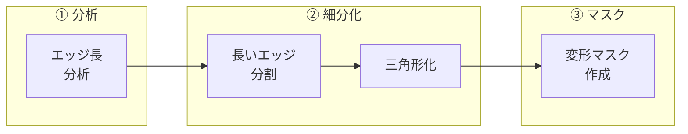
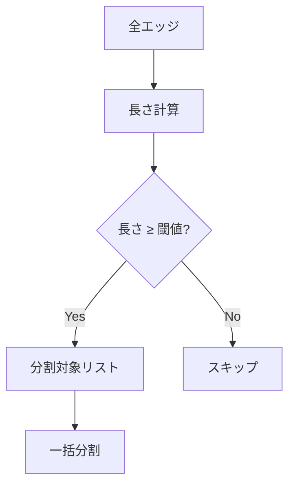

# スムージングの数学

メッシュ細分化とエッジ処理で使う数学を解説。

---

## 全体像



関連: [geometry](geometry.md) | [weights](weights.md) | [transforms](transforms.md)

---

## ① エッジ長分析

問題: 長すぎるエッジがあると変形が粗くなる

解決: 中央値を基準に長いエッジを検出

```python
# infrastructure/blender/mesh.py: subdivide_long_edges()
edge_lengths = [e.calc_length() for e in bm.edges]
edge_lengths.sort()
median = edge_lengths[n // 2]
threshold = median * max_edge_length_ratio  # デフォルト: 2.0倍
```

### なぜ中央値か

| 統計量 | 特徴 | 適性 |
|-------|------|------|
| 平均 | 外れ値に弱い | ✗ |
| 中央値 | 外れ値に強い | ✓ |

---

## ② エッジ細分化

問題: 閾値を超えるエッジを分割したい

解決: BMeshの `subdivide_edges` を使用



```python
# infrastructure/blender/mesh.py: subdivide_long_edges()
edges_to_sub = [e for e in bm.edges if e.calc_length() >= threshold]
bmesh.ops.subdivide_edges(bm, edges=edges_to_sub, cuts=1)
```

---

## ③ 三角形化

問題: N角形（4角形以上）は計算が複雑

解決: 全ての面を三角形に変換

```python
# infrastructure/blender/mesh.py: triangulate_mesh()
bpy.ops.mesh.quads_convert_to_tris(
    quad_method="FIXED",      # 固定パターンで分割
    ngon_method="BEAUTY"      # 見た目優先で分割
)
```

### 分割手法

| 手法 | 用途 |
|-----|------|
| FIXED | 一貫性重視（4角形） |
| BEAUTY | アスペクト比優先（N角形） |

---

## ④ 変形マスク

問題: 特定のボーンに影響される頂点だけ処理したい

解決: ヒューマノイドボーンのウェイト合計をマスク値に

```python
# infrastructure/blender/mesh.py: create_deformation_mask()
for group_name in group_names:  # ヒューマノイドボーン群
    weight = get_vertex_weight(vert, group_name)
    if weight > 0:
        weight_sum += weight

deformation_mask.add([vert.index], weight_sum, "REPLACE")
```

ポイント: マスク値 = 変形の影響度

---

## 数学的な関係

| 演算 | 用途 | 関数 |
|-----|------|------|
| 中央値 | ロバストな基準値 | `subdivide_long_edges` |
| 比率計算 | 閾値決定 | `subdivide_long_edges` |
| 合計 | マスク値計算 | `create_deformation_mask` |

---

## 用語集

| 用語 | 説明 |
|-----|------|
| BMesh | Blenderの編集可能メッシュ構造 |
| 中央値 | ソート済みデータの中央の値 |
| 三角形化 | N角形を三角形に分割 |
| 変形マスク | 頂点の変形適用度を示すウェイト |

---

## ナビゲーション
- [ドキュメント目次](../README.md)
- [技術解説 (Math Guide)](geometry.md)
