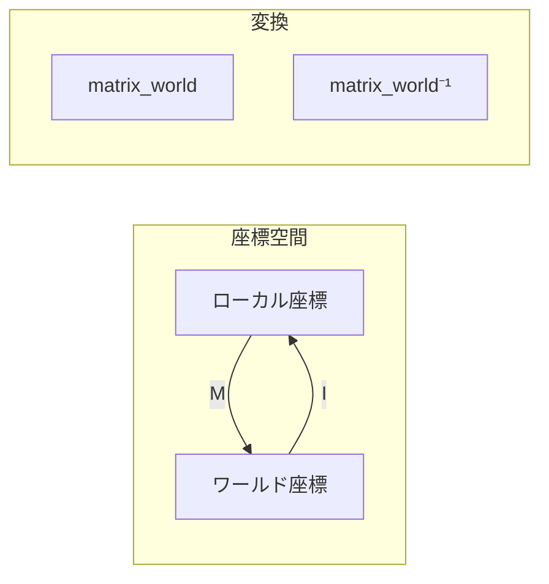
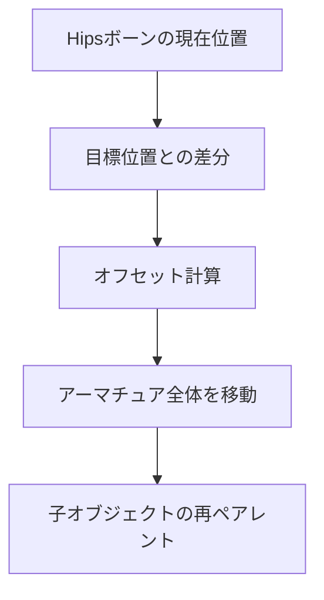

# 座標変換の数学

ローカル/ワールド座標変換とボーン調整で使う数学を解説。

---

## 全体像



関連: [geometry](geometry.md) | [weights](weights.md) | [smoothing](smoothing.md)

---

## ① 座標空間

### ローカル座標 vs ワールド座標

| 座標系 | 原点 | 用途 |
|-------|------|------|
| ローカル | オブジェクト中心 | メッシュデータ格納 |
| ワールド | シーン原点 | オブジェクト間の位置比較 |

```python
# ローカル → ワールド
world_pos = obj.matrix_world @ vert.co

# ワールド → ローカル
local_pos = obj.matrix_world.inverted() @ world_pos
```

---

## ② 変換行列

### 4x4変換行列の構造

$$
M = \begin{pmatrix}
R_{3×3} & t \\
0 & 1
\end{pmatrix}
$$

- R: 回転・スケール（3×3）
- t: 平行移動（3×1）

### Blenderでの使用

```python
# infrastructure/blender/armature.py: adjust_armature_hips_position()
current_position = armature_obj.matrix_world @ pose_bone.head
offset = target_position - current_position
armature_obj.location += offset
```

---

## ③ ボーン位置調整

問題: 衣装のHipsボーンがアバターと一致しない

解決: オフセットを計算し、アーマチュア全体を移動



### 閾値判定

```python
# 0.1mm以下の差は無視
if offset.length < 0.0001:
    return
```

ポイント: ベクトルの長さ（ノルム）で距離を判定

---

## ④ 評価済みメッシュ

問題: モディファイア適用後の頂点位置が欲しい

解決: `evaluated_get()` で評価済みオブジェクトを取得

```python
# infrastructure/blender/armature.py: get_evaluated_mesh()
depsgraph = bpy.context.evaluated_depsgraph_get()
evaluated_obj = obj.evaluated_get(depsgraph)
bm = bmesh.new()
bm.from_mesh(evaluated_obj.data)
bm.transform(obj.matrix_world)  # ワールド座標に変換
```

---

## 数学的な関係

| 演算 | 式 | 用途 |
|-----|-----|------|
| 行列乗算 | `M @ v` | 座標変換 |
| 逆行列 | `M.inverted()` | 逆変換 |
| ベクトル減算 | `a - b` | オフセット計算 |
| ノルム | `v.length` | 距離判定 |

---

## 用語集

| 用語 | 説明 |
|-----|------|
| matrix_world | オブジェクトのワールド変換行列 |
| depsgraph | Blenderの依存関係グラフ |
| pose_bone | ポーズモードでのボーン |
| edit_bone | 編集モードでのボーン |

---

## ナビゲーション
- [ドキュメント目次](../README.md)
- [技術解説 (Math Guide)](geometry.md)
