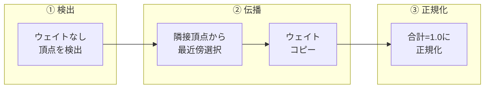
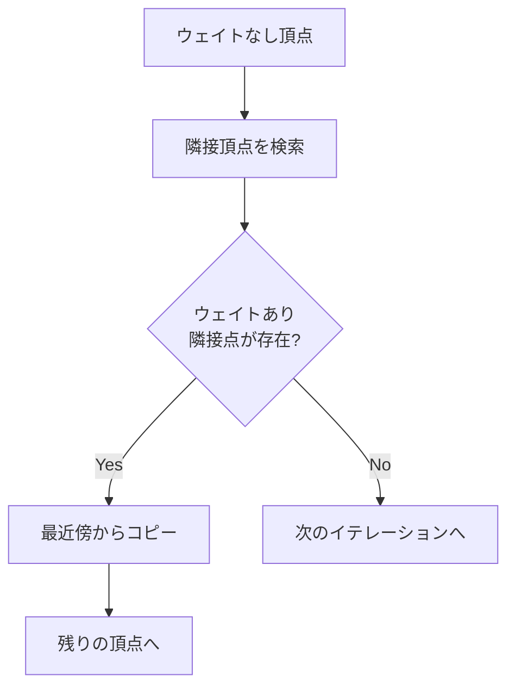
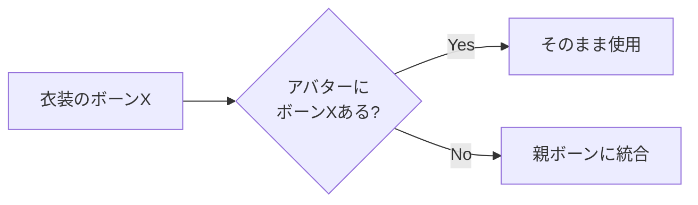

# ウェイト計算の数学

頂点ウェイトの伝播・正規化で使う数学を解説。

---

## 全体像



関連: [geometry](geometry.md) | [transforms](transforms.md) | [smoothing](smoothing.md)

---

## ① ウェイト伝播

問題: メッシュ変形後、一部の頂点がどのボーンにも属さなくなる

解決: 隣接頂点からウェイトを「伝播」



### アルゴリズム

1. エッジ隣接 - BMeshで `link_edges` を使用
2. 最近傍選択 - 距離が最小の隣接頂点
3. 反復実行 - 全頂点に伝播するまで繰り返し

```python
# infrastructure/blender/weights.py: propagate_bone_weights()
for edge in vert.link_edges:
    other = edge.other_vert(vert)
    if vertex_weights[other.index]:
        neighbors.add(other)

closest_vert = min(neighbors, key=lambda v: (v.co - vert.co).length)
```

ポイント: 最大500回の反復で、孤立した頂点群も到達可能

---

## ② ウェイト正規化

問題: 頂点の全ボーンウェイト合計が1.0でないと変形が崩れる

解決: 各頂点でウェイトを正規化

$$
w'_i = \frac{w_i}{\sum_{j} w_j}
$$

```python
# infrastructure/blender/weights.py: normalize_vertex_weights()
total = sum(g.weight for g in vert.groups)
if total > 0:
    for g in vert.groups:
        g.weight /= total
```

---

## ③ 欠損ボーン処理

問題: 衣装のボーンがアバターに存在しない

解決: 親ボーンにウェイトを統合



### 使用箇所

```python
# infrastructure/blender/weights.py: process_missing_bone_weights()
# 親ボーンへのマッピングを構築
parent_map = get_bone_parent_map(bone_hierarchy)
```

---

## 数学的な関係

| 演算 | 用途 | モジュール |
|-----|------|-----------|
| ユークリッド距離 | 最近傍選択 | `infrastructure/blender/weights.py` |
| 正規化 | ウェイト合計=1.0 | `infrastructure/blender/weights.py` |
| グラフ走査 | ボーン階層探索 | `infrastructure/blender/weights.py` |

---

## 用語集

| 用語 | 説明 |
|-----|------|
| 頂点ウェイト | 頂点がボーンに追従する度合い（0.0〜1.0） |
| 頂点グループ | Blenderでのウェイト管理単位 |
| デフォームボーン | メッシュ変形に使用するボーン |
